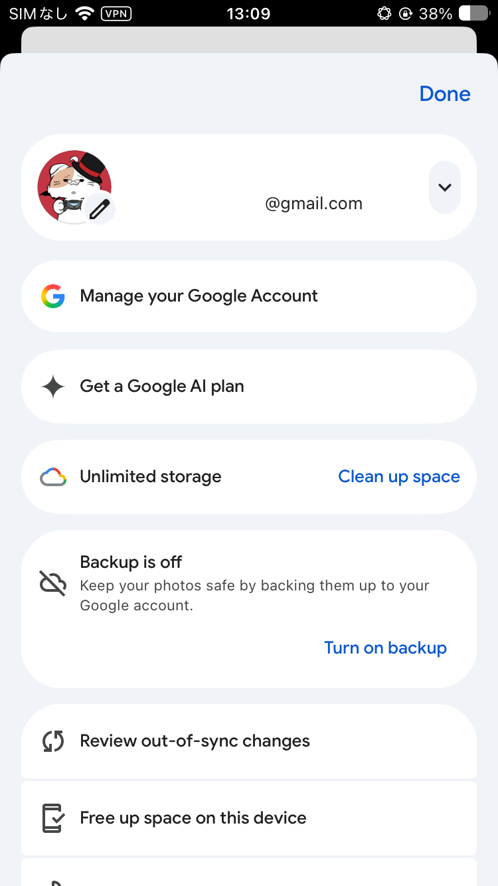
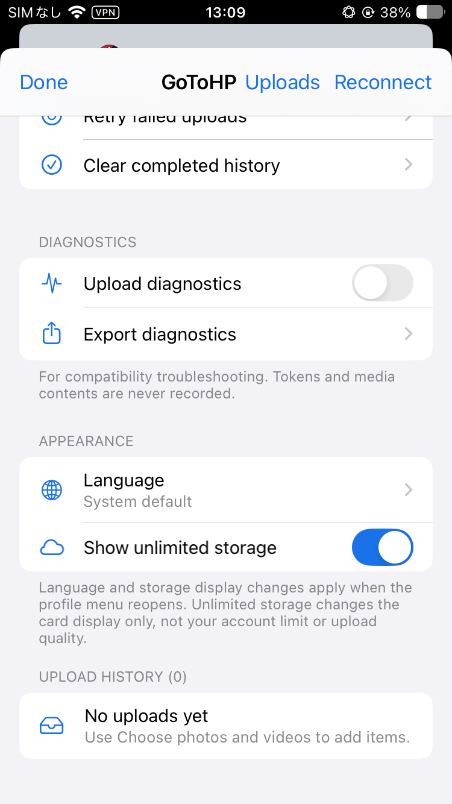

# GoToHP for iOS — Gunshot

[English](README.md) · [日本語](README.ja.md)

A Google Photos uploader for jailbreak, sideloading and LiveContainer, using the Go core from [xob0t/gotohp](https://github.com/xob0t/gotohp). Jailbreak builds upload through a separate daemon; jailed builds run inside Google Photos.

**Development build.** Supports the fixed **7.20.2** adapter and a **7.92.0+** adapter that checks the native APIs each feature needs. The versions audited from supplied IPAs are **7.20.2 (iOS 16.1+)** and **7.92.0 (iOS 18.0+)**; these are reference versions, not an upper-version limit. Later releases are enabled when their APIs match, but are not device-verified. See the [compatibility audit](docs/analysis/google-photos-7.20.2.md).

## Screenshots

<p>
  
  
</p>
<p>
  
  
  
</p>

## Disclaimer

An unofficial project unaffiliated with Google or Apple, provided **as is, without warranty**. Private APIs and app updates may break functionality or lead to account restrictions, data loss or storage charges. Keep a separate backup of your originals. Google Photos binaries, signing certificates and credentials are not distributed here.

## Install and use

> [!IMPORTANT]
> **Sign in to Google Photos before installing or enabling the tweak.** Injection has caused Google to reject login in a reported Sideloadly setup.
>
> 1. Install Google Photos without injection and complete Google sign-in.
> 2. Close the app, then install/enable the jailbreak tweak or update the same app with the injected IPA. Preserve the **signing account, bundle identifier and app data**. In LiveContainer, enable the tweak or update the IPA in the **same guest/data container**.
> 3. Open **Google Photos profile menu → GoToHP settings**.
>
> Do not delete the logged-in app/guest or create a new data container. Session retention is not guaranteed, including when moving from the App Store version to a separately signed app. See the [installation guide](docs/jailed.md).

### Sideloading / LiveContainer

Get `gotohp-tweak-jailed` from [GitHub Actions](https://github.com/tqmane/gunshot/actions): it contains the `.deb`, `GunshotJailed.dylib` and notices. Use the [installation guide](docs/jailed.md) to inject the package or import the dylib into LiveContainer.

GoToHP connects the signed-in Google Photos account. Choose **Uploads → Choose photos and videos** to upload. **Keep Google Photos in the foreground**; jailed uploads cannot continue after the app closes.

On jailed Google Photos 7.20.2 and compatible 7.92.0+ releases, **Route manual and automatic backups through GoToHP** is off by default. Enable it and confirm the destination to route supported backup actions without opening GoToHP. Automatic backup also requires backup to be on in Google Photos. See [supported routes](docs/analysis/backup-routing.md) and [remaining coverage gaps](docs/full-upload-replacement.md).

### Jailbreak

Install the `gotohp-tweak-rootless` or `gotohp-tweak-rootful` `.deb` from GitHub Actions with your package manager. RocketBootstrap, PreferenceLoader and a substrate-compatible injection system are required. If the app exits at launch with `EXC_GUARD / SEND_INVALID_REPLY`, see the [Lynx / Cephei / RocketBootstrap crash analysis and isolation steps](docs/analysis/startup-crash-ios16.md).

In **Settings → GoToHP → Open GoToHP settings**, import an account using the [upstream sign-in instructions](https://github.com/xob0t/gotohp#sign-in). Upload from Google Photos' GoToHP settings, the Apple Photos GoToHP button or a supported **Upload with GoToHP** share action. Keep the app open until media reaches the queue; the daemon then continues independently.

## Quality and queue

| Setting | Device profile / requested behavior |
| --- | --- |
| Original | Pixel XL (Pixel 1), original quality without storage usage |
| Storage saver | Pixel 2, storage saver |
| Account storage | Pixel 8, original quality using normal quota |

These are requests, not guarantees. Verify original-data availability and Google storage usage separately; a successful upload does not establish quota treatment. Account and quality are fixed when each item is queued; changing settings does not alter existing jobs.

PhotoKit uploads use original resources without re-encoding, including both Live Photo components. The queue supports progress, retry, cancellation and restart recovery. Retries restart the file transfer. An interrupted commit with an unknown outcome needs manual review/retry and may produce duplicates. Cancellation does not delete media already saved in Google Photos.

## Languages

English and Japanese are included. Choose **GoToHP settings → Appearance → Language**; unsupported device languages fall back to English. No separate translation bundle is needed. [Add translations](docs/localization.md).

## Build

Requires macOS, Xcode command line tools, Go 1.26.0, Theos, `ldid` and `dpkg`.

```sh
git clone --recurse-submodules https://github.com/tqmane/gunshot.git
cd gunshot
export THEOS="$HOME/theos"
bash scripts/package.sh jailed  # or rootless / rootful
```

Run the local checks:

```sh
python3 scripts/localization.py --check
python3 scripts/prepare-core.py
go test -race -tags cli ./...
go test -tags cli app/backend
go vet -tags cli ./...
```

CI runs tests and builds all three packages. Successful `v*` tags publish release assets. To update the pinned upstream, run `bash scripts/sync-upstream.sh [commit]`; keep its license and generated notices with distributions.

## Development docs

- [Architecture, credentials and upstream integration](docs/architecture.md)
- [Google Photos analysis](docs/analysis/index.md) (Japanese)
- [Device validation](docs/device-validation.md)
